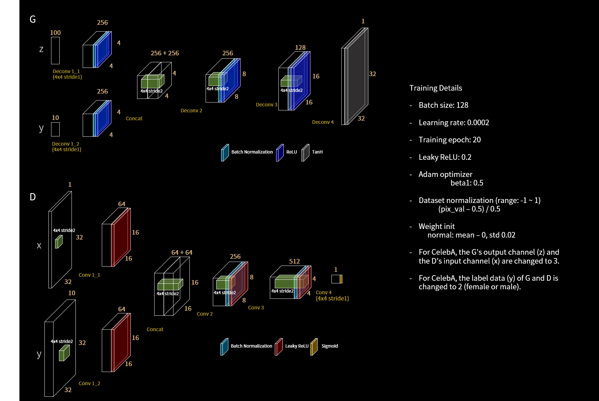

# pytorch-MNIST-CelebA-cGAN-cDCGAN
Pytorch implementation of conditional Generative Adversarial Networks (cGAN) [1] and conditional Generative Adversarial Networks (cDCGAN) for MNIST [2] and CelebA [3] datasets.

* The network architecture (number of layer, layer size and activation function etc.) of this code differs from the paper.

* CelebA dataset used gender lable as condition.

* If you want to train using cropped CelebA dataset, you have to change isCrop = False to isCrop = True.

* you can download
  - MNIST dataset: http://yann.lecun.com/exdb/mnist/
  - CelebA dataset: http://mmlab.ie.cuhk.edu.hk/projects/CelebA.html

## Implementation details
* cGAN

* cDCGAN

## Resutls
### MNIST
* Generate using fixed noise (fixed_z_)

<table align='center'>
<tr align='center'>
<td> cGAN</td>
<td> cDCGAN</td>
</tr>
<tr>
<td>
<td>
</tr>
</table>

* MNIST vs Generated images

<table align='center'>
<tr align='center'>
<td> MNIST </td>
<td> cGAN after 50 epochs </td>
<td> cDCGAN after 20 epochs </td>
</tr>
<tr>
<td>
<td>
<td>
</tr>
</table>

* Learning Time
  * MNIST cGAN - Avg. per epoch: 9.13 sec; Total 50 epochs: 937.06 sec
  * MNIST cDCGAN - Avg. per epoch: 47.16 sec; Total 20 epochs: 1024.26 sec

### CelebA
* Generate using fixed noise (fixed_z_; odd line - female (y: 0) & even line - male (y: 1); each two lines have the same style (1-2) & (3-4).)

<table align='center'>
<tr align='center'>
<td> cDCGAN</td>
<td> cDCGAN crop</td>
</tr>
<tr>
<td>
<td>
</tr>
</table>

* CelebA vs Generated images

<table align='center'>
<tr align='center'>
<td> CelebA </td>
<td> cDCGAN after 20 epochs </td>
<td> cDCGAN crop after 30 epochs </td>
</tr>
<tr>
<td>
<td>
<td>
</tr>
</table>

* CelebA cDCGAN morphing (noise interpolation)
<table align='center'>
<tr align='center'>
<td> cDCGAN </td>
<td> cDCGAN crop </td>
</tr>
<tr>
<td>
<td>
</tr>
</table>

* Learning Time
  * CelebA cDCGAN - Avg. per epoch: 826.69 sec; total 20 epochs ptime: 16564.10 sec

## Development Environment

* Ubuntu 14.04 LTS
* NVIDIA GTX 1080 ti
* cuda 8.0
* Python 2.7.6
* pytorch 0.1.12
* torchvision 0.1.8
* matplotlib 1.3.1
* imageio 2.2.0

## Reference

[1] Mirza, Mehdi, and Simon Osindero. "Conditional generative adversarial nets." arXiv preprint arXiv:1411.1784 (2014).

(Full paper: https://arxiv.org/pdf/1411.1784.pdf)

[2] Y. LeCun, L. Bottou, Y. Bengio, and P. Haffner. "Gradient-based learning applied to document recognition." Proceedings of the IEEE, 86(11):2278-2324, November 1998.

[3] Liu, Ziwei, et al. "Deep learning face attributes in the wild." Proceedings of the IEEE International Conference on Computer Vision. 2015.
